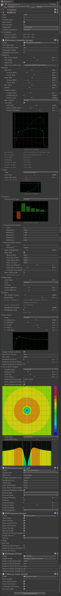

# Early Access {: .title }

Early Access to Vehicle Physics Pro is available with the [Professional License](index.md#licensing)
add-on ($200).
{: .title }

---

!!! warning "&fa-warning; **Alpha stage**. Please have in mind:"

	**Alpha stage** means active research & development, with frequent changes that will surely
	break past dependencies. **Everything is provided as is without any warranty**.

	- Some components and scripts are yet to be written or completed.
	- Some actual components and scripts will be significantly modified.
	- Some features already available in the other package [Edy's Vehicle Physics](http://www.edy.es/dev/vehicle-physics)
	are yet to be ported here (i.e. skidmarks, smoke...)
	- Repository contains code, scenes and libraries from past development iterations. It will be
	cleaned up soon.
	- **Documentation is being actively written**. Many parts are still missing. Some documented
	features may not have been developed yet or may be described in a different way than they work
	right now. In some cases I'm even using the documentation as annotated roadmap for the upcoming
	developments.
    - **The project is actually being developed in <u>Unity 4</u>**. There is a very serious
	bug at the WheelCollider in Unity 5 (beta 22 when writing this) that turns the vehicles
	unstable above certain speed (~120 Km/h or 75 mph). The project will be upgraded to Unity 5
	as soon as this bug is resolved. The Vehicle Physics core package will be compatible with both
	Unity 4 and 5.

!!! info "&fa-thumbs-o-up; Feedback is welcome!"

	- General usage, workflow, integration in current projects.
	- Scripts: class and member naming.
	- Simulation: components, settings, behavior.
	- Documentation: things you would want to learn, know about, or are not fully understood.
	- Documentation: typo and grammar fixes.

	Feel free to write me to [edytado@gmail.com](mailto:edytado@gmail.com).

### Project setup

As professional licensee you should have received credentials for accessing the repositories. You
can browse them at [projects.edy.es](http://projects.edy.es).

- **Vehicle Physics Pro** is my actual Unity project as sandbox for development. It contains all
the evolutions of the vehicle physics scripts since I started researching my own tire model.
- **Common Tools core** is a submodule with common tools and scripts.
- **Vehicle Physics core** is the submodule that actually contains the latest vehicle physics
scripts only.

Instructions:

1.	Clone the **Vehicle Physics Pro** repository locally.

		> git clone ssh://git@projects.edy.es/edy/vehicle-physics-pro.git

2.	Check out the **wip** branch (_master_ branch is an obsolete iteration)

		> cd vehicle-physics-pro
		> git checkout wip

3. 	Fetch and update the submodules:

		> git submodule update --init --recursive

4.	Now you can open the project at the folder **vehicle-physics-pro** with Unity 4.

You could configure **GIT with ssh** for using the repositories without having to entering your
credentials each time. [Instructions here](http://projects.edy.es/trac/edy_vehicle-physics/wiki/GitSetup)

### Sandbox scene

The development scenes, tests, etc are located in the folder **NinjaCamp v2**. The actual sandbox
scene I'm using for development and testing is **NinjaTest v2** in this folder.

When playing the scene the vehicle begins with the engine off. For starting the engine:

1. Press <kbd>K</kbd> for moving the ignition key from "Off" to "Drive" (check out the telemetry
window)
2. Press and hold <kbd>K</kbd> for moving the ignition key to "Start" and actually start the engine.

	<kbd>ctrl-K</kbd> moves the ignition key back to the "Off" switching off the engine.

##### Keys used

Key(s) | Function | Notes
:------:| -------- | -----
<kbd>K</kbd> | Ignition key | Press to move from "Off" to "Drive". Press and Hold for "Start". <kbd>ctrl+K</kbd> moves the key back to "Off".
<kbd>left</kbd><kbd>right</kbd> | Steering |
<kbd>up</kbd> | Throttle |
<kbd>down</kbd> | Brakes |
<kbd>shift</kbd> | Clutch | Actual vehicle setup uses a Torque Converter, which doens't require active clutch. Still, the clutch can be used to completely disengage the engine from the transmission.
<kbd>space</kbd> | Handbrake | Affects rear wheels. Clutch should be used if vehicle uses a standard clutch to prevent the engine to stall.
<kbd>ctrl+space</kbd> | Toogle all brakes | Brakes are toggled in all wheels.
<kbd>R</kbd> | Reverse gear | If auto-shift is enabled R requires the vehicle to be nearly stopped and brakes released.
<kbd>N</kbd> | Neutral gear | Auto-shift will engage first gear when throttle is applied.
<kbd>Tab</kbd> | Gear Up | Auto-shift might revert to the previous gear
<kbd>Caps Lock</kbd> | Gear Down | Auto-shift might revert to the previous gear
<kbd>1</kbd>-<kbd>5</kbd> | Engage gear | Auto-shift might discard the change and choose a more convenient gear
<kbd>Page up</kbd><kbd>Page down</kbd> | Gear mode | Select the different gear modes in Automatic transmission (M P R N D L). The actual modes may be engaged or not depending on specific conditions (i.e. Reverse requires the vehicle to be nearly stopped).
<kbd>alt+mouse</kbd> | Camera movement and zoom

The main component that implements the vehicle simulation is **[VPVehicleController](components/vehicle-controller.md)**.
The object **NinjaVehicle v2** in the sandbox scene contains this component with all its settings
to play with.

The actual setup of the vehicle is:

- **Engine:** powerful engine (140 hp) with rather realistic stall settings.
- **Clutch:** torque converter, which doesn't require an active clutch pedal, and makes the engine
harder to stall. Still, clutch can be manually engaged with <kbd>shift</kbd>.
- **Gearbox:** manual 5-speed gearbox with auto-shift enabled
- **Differential:** 20% viscous differential at the driven rear axle.
- **Brakes:** 70:30 balanced to the front.
- **Tire friction:** Isotropic Pacejka friction with a peak coefficient of friction of 1.1. Tire
relaxation is enabled with a rate simulating standard road wheels.
- **Solver:** Euler with two integration steps. Physic step is 0.02 seconds (50Hz), so vehicle
calculations are done at 100Hz.
- Other settings are mostly part of the development tests.

### Code and scripts

Current layout:

    Assets
    |- Core
	|	|- Common Tools core
	|   |- Vehicle Physics core
	|		|- Base
	|		|- Components
	|		|- VehicleComponents
    |- NinjaCamp v2
	|- Standard Assets
	|- Vehicles
	|- World

The vehicle physics scripts are inside the **Vehicle Physics core** folder. The main script
to look at is `VPVehicleController.cs`. This class derives from `VPVehicleControllerBase.cs` and
overrides its virtual methods for implementing the vehicle's internals with the available classes:
([engine](classes/engine.md), [gearbox](classes/gearbox.md), [differential](classes/differential.md)
...). [VPVehicleControllerBase](classes/vehicle-controller-base.md) contains the integration solver
class ([VPSolver](classes/solver.md)) and the wheels ([VPCWheel](classes/wheel.md)), which receive
the final torques and calculate the tire forces.

Vehicles are internally modeled as a graph of connected objects that derive from [VPComponent](classes/component.md).
Each component can receive input torques and produce output torques. Wheels ([VPCWheel](classes/wheel.md))
are components that receive torques at their inputs. Motors ([VPCEngine](classes/engine.md))
are components that produce torques at their outputs. Other components have torque inputs and
torque outputs. This allows to simulate any kind of internal configuration of the vehicle by
connecting components in any combination.

Vehicle components are created, initialized and connected within the `VPVehicleController.cs`
script, `OnInitialize` method. Check out the comments in the file `VPVehicleControllerBase.cs` for
indications on how the vehicles are implemented and simulated by overriding the virtual methods.

!!! info "&fa-info-circle; Useful resources"

	- [Early Preview article in the Blog](http://www.edy.es/dev/2014/11/early-preview-of-vehicle-physics-pro/)
	- [Development screenshots and videos](https://twitter.com/VehiclePhysics/media)
	- [Miscellaneous topics explained](advanced/misc-topics-explained.md)
	- [Data Bus reference](advanced/databus-reference.md)

### Components

Actual inspector for the vehicle GameObject. Gearbox is work in progress at the time of taking
this capture:

---