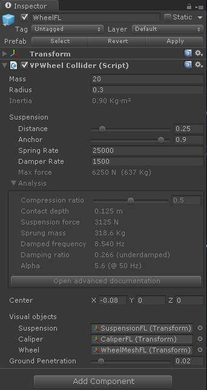
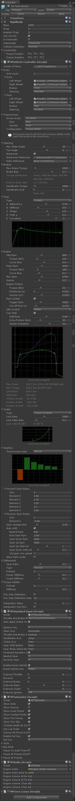

# Early Access {: .title }

Early Access to Vehicle Physics Pro is now available with the [Professional License](index.md#licensing)
add-on. The Professional license is offered at discounted price during the development stage (<del> \$480 </del> &nbsp; **\$290**).
{: .title }

---

!!! warning "&fa-warning; **Alpha stage**. Please have in mind:"

	**Alpha stage** means active research & development, with frequent changes that will surely
	break past dependencies. **Everything is provided as is without any warranty**.

	- Some components and scripts are yet to be written or completed.
	- Some actual components and scripts will be significantly modified.
	- Some features already available in the other package [Edy's Vehicle Physics](http://www.edy.es/dev/vehicle-physics)
	are yet to be ported here (i.e. driving aids...)
	- **Documentation is being actively written**. Many parts are still missing. Some documented
	features may not have been developed yet or may be described in a different way than they work
	right now. In some cases I'm even using the documentation as annotated roadmap for the upcoming
	developments.
    - **This is a Unity 5 project**, but the repository also contains a branch for Unity 4. Vehicle
	Physics Pro is compatible with both.
	- **[Blender](http://www.blender.org)** must be installed for the 3D objects to be imported.
	This requirement will be lifted at some point during the Beta stage.

!!! info "&fa-thumbs-o-up; Feedback is welcome!"

	- General usage, workflow, integration in current projects.
	- Scripts: class and member naming.
	- Simulation: components, settings, behavior.
	- Documentation: things you would want to learn, know about, or are not fully understood.
	- Documentation: typo and grammar fixes.

	Feel free to write me to [edytado@gmail.com](mailto:edytado@gmail.com).

### Project setup

As professional licensee you should have received credentials for accessing the repositories. You
can browse them at [projects.edy.es](http://projects.edy.es).

- **Vehicle Physics Pro** is the main project.
- **Common Tools core** is a submodule with common tools and scripts.
- **Vehicle Physics core** is the submodule that actually contains the latest vehicle physics
scripts only.
- **Vehicle Physics core assets** is a submodule with common objects, materials and textures used
across different vehicle physics projects.

##### Setting up the project locally

1.	Clone the repository **Vehicle Physics Pro** locally. Go to a folder of your choice, then:

		> git clone --depth=1 http://projects.edy.es/git/edy/vehicle-physics-pro.git

	or, if you've configured the access via ssh (see below):

		> git clone --depth=1 ssh://git@projects.edy.es/edy/vehicle-physics-pro.git

2. 	Fetch and update the submodules:

		> cd vehicle-physics-pro
		> git submodule update --init --recursive

3.	Now you can open the project at the folder **vehicle-physics-pro** with Unity 5.

##### Upgrading to the latest revision

	> git pull --recurse-submodules
	> git submodule update --init --recursive

The above is also necessary after checking out any branch in the local repository.

##### Configuring repository access via ssh

Configuring ssh access allows performing the common operations on the repository without having to
enter your credentials each time.

1.	Generate the ssh keys. Follow the steps 1 to 3 at the [GitHub's step-by-step guide for
generating ssh keys](https://help.github.com/articles/generating-ssh-keys/).

2.	Configure the ssh public key at [your profile in the project's pages](http://projects.edy.es/users/my_profile#public_keys).

If you already had cloned the repository via http then you need to modify the remote's URL. Follow
the [instructions for changing a remote's URL](https://help.github.com/articles/changing-a-remote-s-url/).

##### Setting up the project in Unity 4

This part is for Unity 4 only. If you're on Unity 5 you should have already the project after
following the previous steps.

Unity 4 setup:

1.	Clone the branch **master-unity4**, which contains the project for Unity 4. Go to a folder of
	your choice, then:

		> git clone -b master-unity4 --single-branch --depth=1 http://projects.edy.es/git/edy/vehicle-physics-pro.git

	or, if you've configured the access via ssh:

		> git clone -b master-unity4 --single-branch --depth=1 ssh://git@projects.edy.es/edy/vehicle-physics-pro.git

2. 	Fetch and update the submodules:

		> cd vehicle-physics-pro
		> git submodule update --init --recursive

3.	Now you can open the project at the folder **vehicle-physics-pro** with Unity 4. The sandbox
	scenes for development are located in the folder _NinjaCamp v2_.

### Sandbox scene

The scenes for tests are under the folder _Scenes_.

_
Click the image for playing the Web Demo
_

When playing the scene the vehicle begins with the engine off. For starting the engine:

1. Press <kbd>K</kbd> for moving the ignition key from "Off" to "Drive" (check out the telemetry
window)
2. Press and hold <kbd>K</kbd> for moving the ignition key to "Start" and actually start the engine.

	<kbd>ctrl-K</kbd> moves the ignition key back to the "Off" switching off the engine.

##### Keys used

Key(s) | Function | Notes
:------:| -------- | -----
<kbd>K</kbd> | Ignition key | Press to move from "Off" to "Drive". Press and Hold for "Start". <kbd>ctrl+K</kbd> moves the key back to "Off".
<kbd>left</kbd><kbd>right</kbd> | Steering |
<kbd>up</kbd> | Throttle |
<kbd>down</kbd> | Brakes |
<kbd>shift</kbd> | Clutch | Actual vehicle setup uses a Torque Converter, which doesn't require active clutch. Still, the clutch can be used to completely disengage the engine from the transmission.
<kbd>space</kbd> | Handbrake | Affects rear wheels. Clutch should be used if vehicle uses a standard clutch to prevent the engine to stall.
<kbd>ctrl+space</kbd> | Toogle all brakes | Brakes are toggled in all wheels.
<kbd>R</kbd> | Reverse gear | If auto-shift is enabled R requires the vehicle to be nearly stopped and brakes released.
<kbd>N</kbd> | Neutral gear | Auto-shift will engage first gear when throttle is applied.
<kbd>Tab</kbd> | Gear Up | Auto-shift might revert to the previous gear
<kbd>Caps Lock</kbd> | Gear Down | Auto-shift might revert to the previous gear
<kbd>1</kbd>-<kbd>5</kbd> | Engage gear | Auto-shift might discard the change and choose a more convenient gear
<kbd>Page up</kbd><kbd>Page down</kbd> | Gear mode | Select the different gear modes in Automatic transmission (M P R N D L). The actual modes may be engaged or not depending on specific conditions (i.e. Reverse requires the vehicle to be nearly stopped).
<kbd>alt+mouse</kbd> | Camera movement and zoom
<kbd>Escape</kbd> | Reset scene
<kbd>T</kbd> | Toggle slow motion mode

The main component that implements the vehicle simulation is **[VPVehicleController](components/vehicle-controller.md)**.
The object **VP Test Vehicle** in the pickup test scene contains this component with all its
settings to play with.

The actual setup of the vehicle is:

- **Engine:** powerful engine (140 hp) with rather realistic stall settings.
- **Clutch:** torque converter, which doesn't require an active clutch pedal, and makes the engine
harder to stall. Still, clutch can be manually engaged with <kbd>shift</kbd>.
- **Gearbox:** manual 5-speed gearbox with auto-shift enabled
- **Transmission:** AWD with main drive power at the rear axle and a torque splitter routing part of
the power to the front axle.
- **Brakes:** 70:30 balanced to the front.
- **Steering:** standard Ackerman geometry.
- **Tire friction:** Isotropic Pacejka friction with a peak coefficient of friction of 1.1. Tire
relaxation is enabled with a rate simulating standard road wheels.
- **Solver:** Euler with two integration steps. Physic step is 0.02 seconds (50Hz), so vehicle
calculations are done at 100Hz.

### Code and scripts

Current layout:

    Assets
    |- Core
	|	|- Common Tools core
	|	|- Vehicle Physics core
	|	|	|- Base
	|	|	|- Classes
	|	|	|- Components
	|	|	|- Editor
	|   |- Vehicle Physics core assets
    |- Scenes
	|- Vehicles
	|- World

The vehicle physics scripts are inside the **Vehicle Physics core** folder. The main script
to look at is `VPVehicleController.cs`. This class derives from `VPVehicleBase.cs` and
overrides its virtual methods for implementing the vehicle's internals with the available classes:
([engine](classes/engine.md), [gearbox](classes/gearbox.md), [differential](classes/differential.md)
...). [VPVehicleBase](classes/vehicle-base.md) contains the integration solver and the
wheels, which receive the final torques and calculate the tire forces.

Vehicles are internally modeled as a graph of connected objects that derive from [VPComponent](classes/component.md).
Each component can receive input torques and produce output torques. Wheels are components that
receive torques at their inputs. Motors ([VPCEngine](classes/engine.md)) are components that produce
torques at their outputs. Other components have torque inputs and torque outputs. This allows to
simulate any kind of internal configuration of the vehicle by connecting components in any
combination.

Vehicle components are created, initialized and connected within the `VPVehicleController.cs`
script, `OnInitialize` method. Check out the comments in the file `VPVehicleBase.cs` for
indications on how the vehicles are implemented and simulated by overriding the virtual methods.

!!! info "&fa-info-circle; Useful resources"

	- [Early Preview article in the Blog](http://www.edy.es/dev/2014/11/early-preview-of-vehicle-physics-pro/)
	- [Development screenshots and videos](https://twitter.com/VehiclePhysics/media)
	- [Miscellaneous topics explained](advanced/misc-topics-explained.md)
	- [Data Bus reference](advanced/databus-reference.md)

### Components

#### VPWheelCollider

Wheels require this component, which replaces the stock WheelCollider:

#### VPVehicleController and add-ons

Actual inspector for the vehicle GameObject. The Vehicle Controller component exposes several
development properties:

