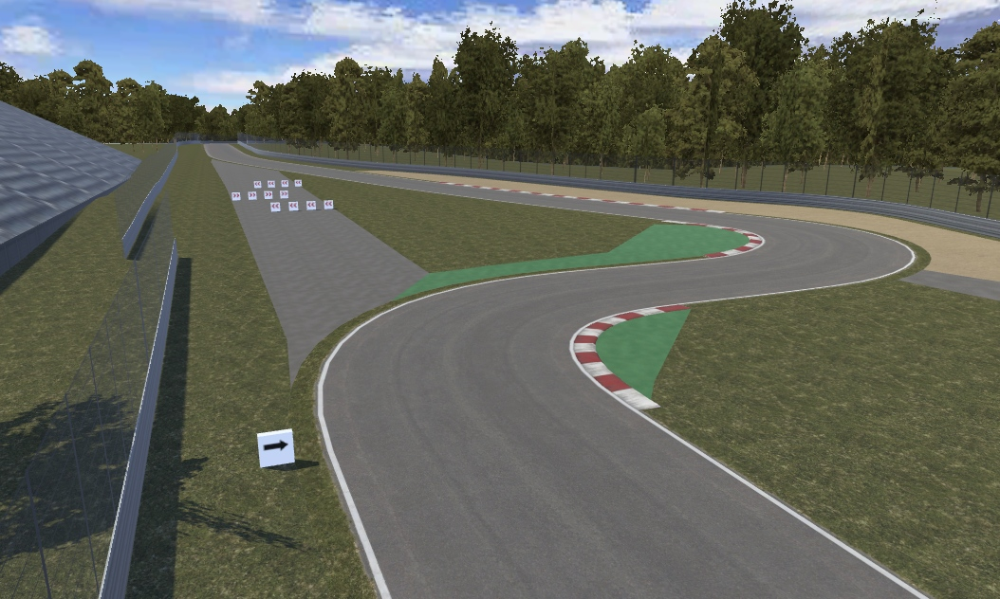

## Vehicle Physics Pro

Advanced vehicle simulation kit for [Unity 3D](http://unity3d.com) providing fully realistic and
accurate vehicle physics.

!!! warning "&fa-warning:lg; Project under development: **Beta stage**"

	**Beta stage** means the project is mature and bug-free enough to be used in actual projects,
	but some features are yet to be developed and issues/bugs might appear. Main code is not
	expected to have significant changes. Still, everything is provided as is without any warranty.

	- Some components and scripts are yet to be written or completed.
	- Some features are yet to be implemented. See the [Roadmap](#development-roadmap) below.
	- **This documentation is being actively written and updated.** Some pages are yet to be
		completed.

	**Early Access** to Vehicle Physics Pro is now available with the Professional and Enterprise
	licenses. [Learn more](about/licensing)

&fa-thumbs-up:lg; Stay tunned! Follow me [@VehiclePhysics](https://twitter.com/VehiclePhysics){: .alert-link} on Twitter for the
latest news and announcements.
{: .alert .alert-success }

	
	
	
	

	
	
	
	

	
	
	
	

Advanced AAA+ vehicle physics simulation

:	Built around an accurate physics solver providing realistic results for all vehicle types and
	setups. The precision of the numeric results depends on the integration steps only.

Modular implementation

:	Vehicle dynamics is implemented as functional blocks with inputs and/or outputs that can be
	connected in any number and combination. Any vehicle setup can be emulated by arranging and
	connecting blocks. Package includes standard vehicle blocks such as engine, clutch, gearbox,
	differential, torque splitter, and more.

Advanced wheel and tire friction simulation

:	Provides accurate friction values in all situations. All torques acting in the wheel are
	properly combined resulting in accurate tire forces and correctly calculated wheel spin rate.

Realistic and coherent

: 	The underlying concept is a custom vehicle simulation model based on essential physics facts:
	forces, torques and frictions. This model is easier to understand and simpler to calculate than
	the commonly used models, yet providing physically accurate and realistic results.

	[More features and details](about/features)

#### Development roadmap

&fa-check; Base: Tire friction, solver, modular torque model
{: .roadmap }

&fa-check; Differential
{: .roadmap }

&fa-check; Steering, Brakes
{: .roadmap }

&fa-check; Engine + clutch
{: .roadmap }

&fa-check; Gearbox
{: .roadmap }

&fa-check; Driveline and axle setup
{: .roadmap }

&fa-check; Repository clean up and upgrade to Unity 5
{: .roadmap }

&fa-check; Skidmarks, smoke, tire trails
{: .roadmap }

&fa-check; Vehicle audio: engine, turbo, impacts, tire skid...
{: .roadmap }

&fa-check; Minor bug fixes and code polishing
{: .roadmap }

&fa-check; Scenes and vehicles for tests
{: .roadmap }

&fa-check; **Enter the Beta stage!**
{: .roadmap }

&fa-gear:spin; Documentation
{: .roadmap .wip }

Replay system
{: .roadmap .todo }

Advanced graphic telemetry
{: .roadmap .todo }

**First release!**
{: .roadmap .todo }

Anisotropic tire friction
{: .roadmap .todo }

Driving aids
{: .roadmap .todo }

Generic wheel controller support
{: .roadmap .todo }

Additional components
{: .roadmap .todo }

!!! info "&fa-thumbs-o-up; Feedback is welcome!"

	- General usage, workflow, integration in current projects.
	- Simulation: components, settings, behavior.
	- Documentation: things you would want to learn, know about, or are not fully understood.
	- Documentation: typo and grammar fixes.

	Feel free to write me to [edy@vehiclephysics.com](mailto:edy@vehiclephysics.com) or via Twitter
	[@VehiclePhysics](https://twitter.com/VehiclePhysics).

<a class="twitter-timeline" href="https://twitter.com/VehiclePhysics" data-widget-id="687956324773179396">Tweets por el @VehiclePhysics.</a>

{: .centered }

<!--
#### About me

Vehicle Physics Pro has been conceived, designed and implemented by [Angel Garcia Voces "Edy"](http://www.edy.es)
at Oviedo, Spain.

> I started creating this kit because I wanted to simulate vehicles since I was a kid playing with my
> Commodore 64. When I discovered Unity 3D that's what I wanted to do since the first day. But I
> didn't find any existing component, kit or document for simulating a vehicle correctly. There were
> all buggy components, too simple approaches, or too complex algorithms/methods/papers mixing
> simulation and automotive industry. I had the feeling (name it intuition) that a _simple_ way of
> simulating vehicles _correctly_ had to exist. And I spend several years researching and
> experimenting with a lot of ideas until I finally nailed it. This Vehicle Physics Pro today: the
> simplest and most efficient approach for simulating a vehicle while actually accounting for all
> major reactions and side effects in a physically correct, coherent and accurate way.
>
> I hope you have as much fun using VPP or playing VPP-based games as I'm having developing it.
-->