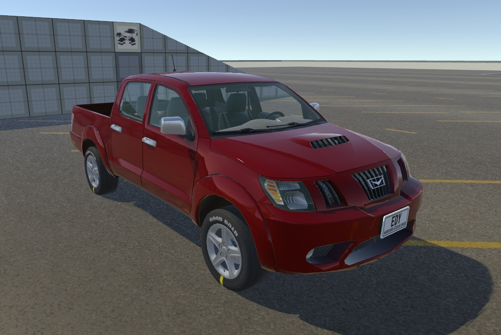
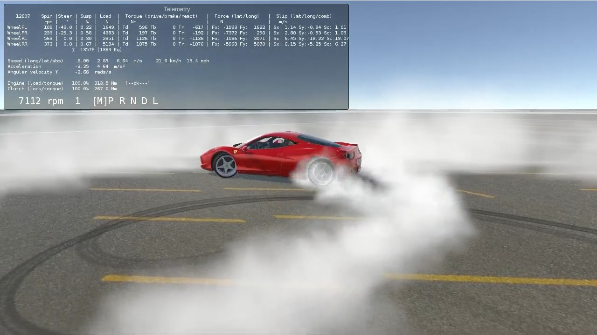
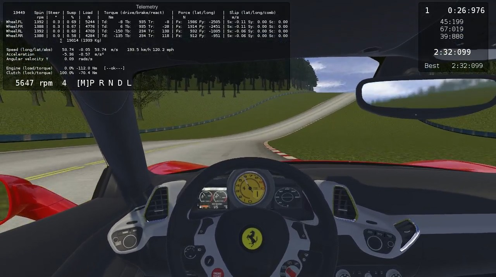
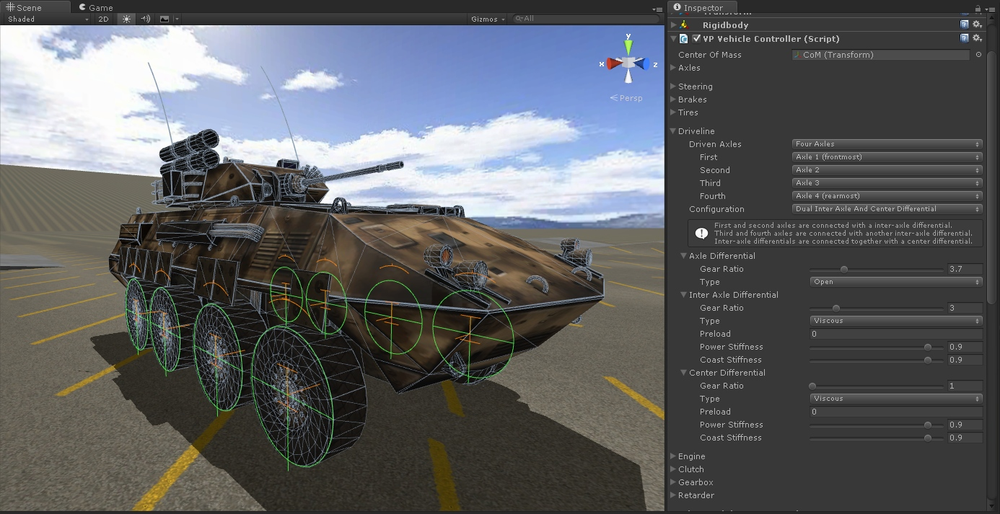
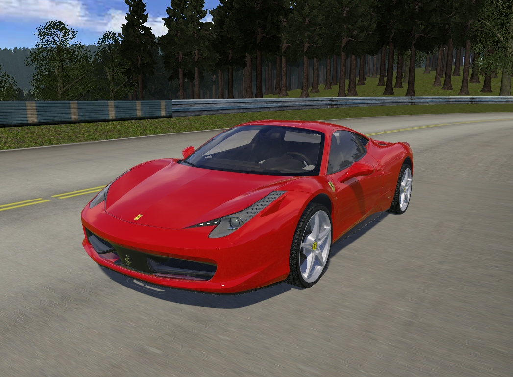
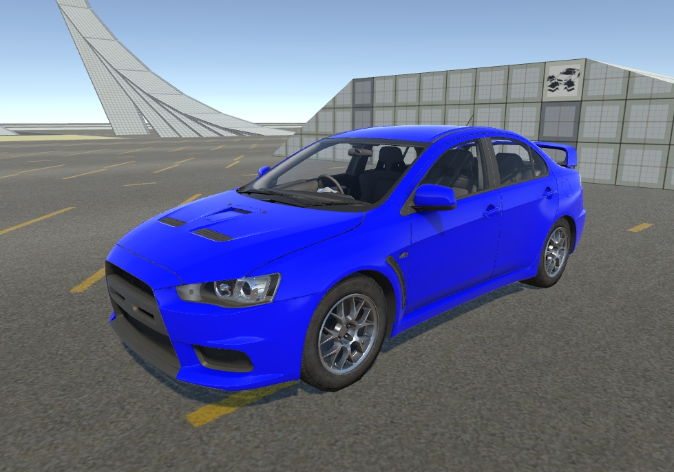
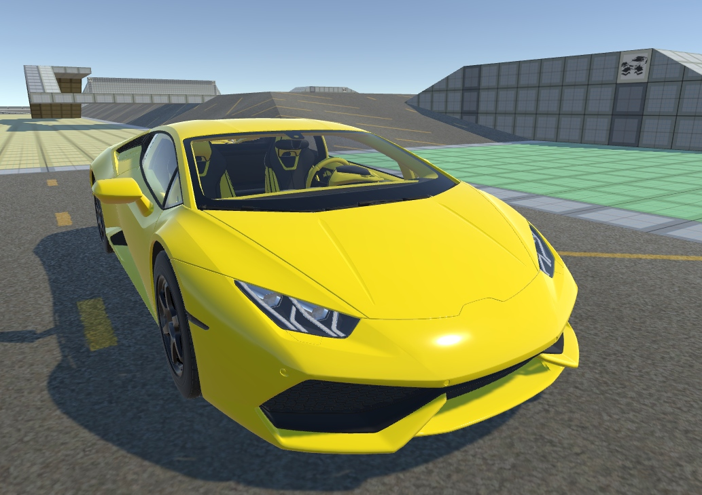
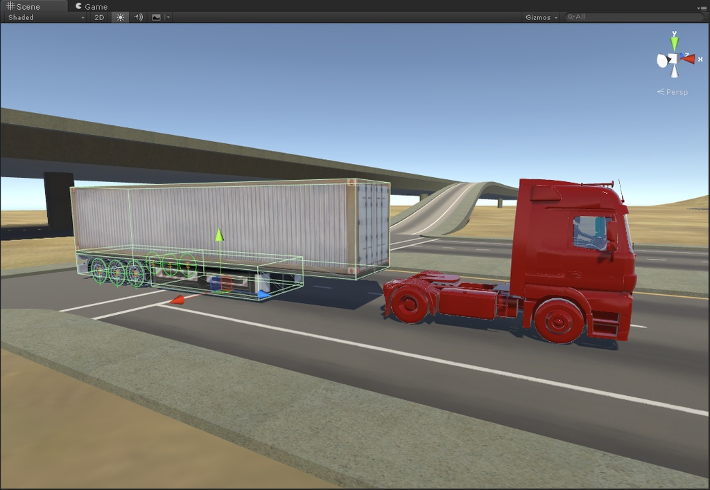
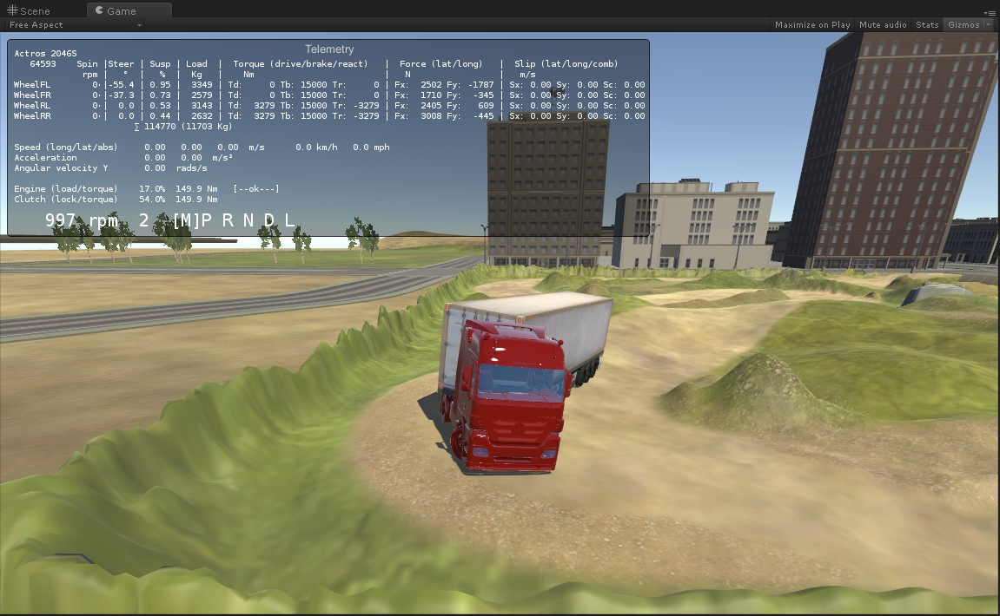
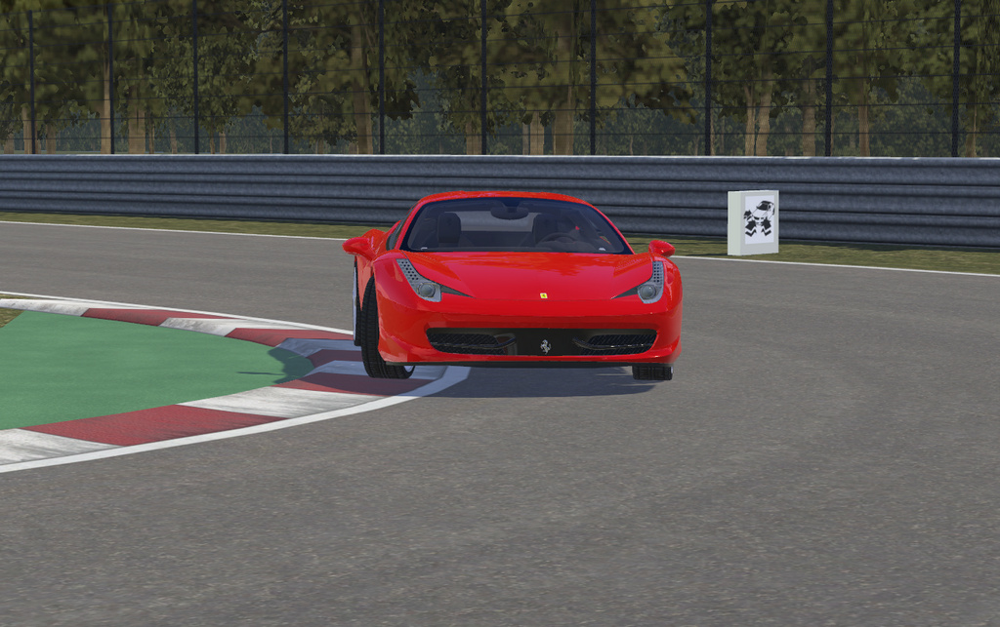

## Vehicle Physics Pro

Advanced vehicle simulation kit for [Unity 3D](http://unity3d.com) providing fully realistic and
accurate vehicle physics.

Quick links: [Feature details](/about/features), [demo downloads](/about/demos), [product walkthrough](/user-guide/getting-started),
[comparing with other vehicle simulation kits](/about/comparison).

!!! warning "&fa-warning:lg; Project under development: **Pre-Release stage**"

	**Pre-release stage** means the project base code is completed and it's safe to use it in
	production projects. At this stage I'm working on the demo scenes, vehicle examples, 3D and
	other art, etc. VPP may receive bug fixes and minor feature improvements before the first
	release.

	**This documentation is being actively written and updated.** Some pages are yet to be
		completed.

	**Early Access** to Vehicle Physics Pro is now available with the Professional and Enterprise
	licenses. [Learn more](about/licensing)

&fa-thumbs-up:lg; &nbsp; Stay tunned! &nbsp; Follow me [@VehiclePhysics](https://twitter.com/VehiclePhysics){: .alert-link}
on Twitter for the latest news and announcements.
{: .alert .alert-success }

<section class="test-slider slider">

{: .clickview }

1 - Create the GameObject
{: .header}

Include the components tal and cual. This is great as the text gets embedded perfectly into the
slides. Next step: increase the horizontal margins here and move the next / prev buttons to this area.

	

	

	

	

	

	

</section>

As shown in the previous carousel, there's still several things to do and configure. For example,
numbers are not highlighted to reflect the current slide.

	<!-- Indicators -->
	<ol class="carousel-indicators">
		<li data-target="#carousel-example-generic" data-slide-to="0" class="active"></li>
		<li data-target="#carousel-example-generic" data-slide-to="1"></li>
		<li data-target="#carousel-example-generic" data-slide-to="2"></li>
		<li data-target="#carousel-example-generic" data-slide-to="3"></li>
		<li data-target="#carousel-example-generic" data-slide-to="4"></li>
		<li data-target="#carousel-example-generic" data-slide-to="5"></li>
		<li data-target="#carousel-example-generic" data-slide-to="6"></li>
	</ol>

	<!-- Wrapper for slides -->
	

		

			
		

		

			
		

		

			
		

		

			
		

		

			
		

		

			
		

		

			
		

	

	<!-- Controls -->
	<a class="left carousel-control" href="#carousel-example-generic" role="button" data-slide="prev">
		
		Previous
	</a>
	<a class="right carousel-control" href="#carousel-example-generic" role="button" data-slide="next">
		
		Next
	</a>

	
	
	
	

	
	
	
	

	
	
	
	

_Some vehicle 3D Models were kindly donated by Trevor Ley and Eric Adams. 
Spa-Francorchamps track gently offered by Jasper Stocker, from the Track BuildR asset._
{: .centered }

Advanced AAA+ vehicle physics simulation

:	Built around an accurate physics solver providing realistic results for all vehicle types and
	setups. The precision of the numeric results depends on the integration steps only.

Modular powertrain design

:	Vehicle dynamics core is implemented with functional blocks with inputs and/or outputs that can
	be connected in any number and combination. Any vehicle setup can be emulated by arranging and
	connecting blocks. VPP includes standard vehicle blocks such as engine, clutch, gearbox,
	differential, torque splitter, and more.

Advanced wheel and tire friction simulation

:	Provides accurate friction values in all situations. All torques acting in the wheel are
	properly combined resulting in accurate tire forces and correctly calculated wheel spin rate.

Realistic and coherent

: 	The underlying concept is a custom vehicle simulation model based on essential physics facts:
	forces, torques and frictions. This model is easier to understand and simpler to calculate than
	the commonly used models, yet providing physically accurate and realistic results.

	[More features and details](about/features)

#### Development roadmap

&fa-check; Base: Tire friction, solver, modular torque model
{: .roadmap }

&fa-check; Differential
{: .roadmap }

&fa-check; Steering, Brakes
{: .roadmap }

&fa-check; Engine + clutch
{: .roadmap }

&fa-check; Gearbox
{: .roadmap }

&fa-check; Driveline and axle setup
{: .roadmap }

&fa-check; Repository clean up and upgrade to Unity 5
{: .roadmap }

&fa-check; [Skidmarks, smoke, tire trails](components/vehicle-addons#vptireeffects)
{: .roadmap }

&fa-check; [Vehicle audio: engine, turbo, impacts, tire skid...](components/vehicle-addons#vpaudio)
{: .roadmap }

&fa-check; Minor bug fixes and code polishing
{: .roadmap }

&fa-check; Scenes and vehicles for tests
{: .roadmap }

&fa-check; **Enter the Beta stage!**
{: .roadmap }

&fa-check; Generic steering wheels support (DirectInput)
{: .roadmap }

&fa-check; [Performance Analysis Charts](components/vehicle-telemetry#vpperformanceanalysis)
{: .roadmap }

&fa-check; Replay system with rewind & continue
{: .roadmap }

&fa-check; Driving aids
{: .roadmap }

&fa-gear:spin; Demo scenes and examples
{: .roadmap .wip }

&fa-gear:spin; Documentation
{: .roadmap .wip }

**First release!**
{: .roadmap .todo }

Package for the Unity Asset Store
{: .roadmap .todo }

Anisotropic tire friction
{: .roadmap .todo }

Hybrid 3D wheel solution
{: .roadmap .todo }

More vehicle types
{: .roadmap .todo }

!!! info "&fa-thumbs-o-up; Feedback is welcome!"

	- General usage, workflow, integration in current projects.
	- Simulation: components, settings, behavior.
	- Documentation: things you would want to learn, know about, or are not fully understood.
	- Documentation: typo and grammar fixes.

	Feel free to write me to [edy@vehiclephysics.com](mailto:edy@vehiclephysics.com) or via Twitter
	[@VehiclePhysics](https://twitter.com/VehiclePhysics).

#### Contributors

My most sincere gratitude to these great artists who contributed or are contributing in some way
with Vehicle Physics Pro:

- Trevor Ley (JPickup)
- [Jasper Stocker](https://www.assetstore.unity3d.com/en/#!/search/page=1/sortby=popularity/query=publisher:412) (Spa-Francorchamps, Stunt Track)
- [HereVR](https://www.assetstore.unity3d.com/en/#!/search/page=1/sortby=popularity/query=publisher:8060) (APC)
- [Dog Machine](https://www.assetstore.unity3d.com/en/#!/search/page=1/sortby=popularity/query=publisher:2914) (Multi-purpose Exploration Vehicle)
- [GameReady 3D](https://www.assetstore.unity3d.com/en/#!/search/page=1/sortby=popularity/query=publisher:1634) (Sound files)

<a class="twitter-timeline" href="https://twitter.com/VehiclePhysics" data-widget-id="687956324773179396">Tweets by @VehiclePhysics</a>

<!--
#### About me

Vehicle Physics Pro has been conceived, designed and implemented by [Angel Garcia Voces "Edy"](http://www.edy.es)
at Oviedo, Spain.

> I started creating this kit because I wanted to simulate vehicles since I was a kid playing with my
> Commodore 64. When I discovered Unity 3D that's what I wanted to do since the first day. But I
> didn't find any existing component, kit or document for simulating a vehicle correctly. There were
> all buggy components, too simple approaches, or too complex and ineffective algorithms/methods/papers
> mixing simulation and automotive industry. I had the feeling (name it intuition) that a _simple_ way of
> simulating vehicles _correctly_ should exist. Then I spend several years researching and
> experimenting with a lot of ideas until I finally nailed it. This Vehicle Physics Pro today: the
> simplest and most efficient approach for simulating a vehicle while actually accounting for all
> major reactions and side effects in a physically correct, coherent and accurate way.
>
> I hope you have as much fun using VPP or playing VPP-based games as I'm having developing it.
-->