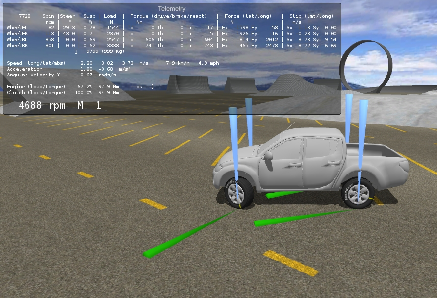

## Vehicle Physics Pro

---

A comprehensive vehicle simulation library designed and conceived from scratch for providing
fully accurate and customizable vehicle physics. Vehicle Physics Pro is available as editor add-on
for [Unity 3D](http://unity3d.com).

Check out an early preview [here](http://www.edy.es/dev/2014/11/early-preview-of-vehicle-physics-pro/).

Play the latest Web Demo scene [here](early-access.md#sandbox-scene).

Stay tunned! Follow **[@VehiclePhysics](https://twitter.com/VehiclePhysics)** on Twitter for the
latest news and announcements.

!!! warning "&fa-warning; Project under development"

	The project status is **Alpha**. This documentation is work in progress. [Early Access](early-access.md)
	to the project's repository is available with the [Professional License](index.md#licensing) (see below).

[{: .img-medium }](early-access.md#sandbox-scene)

#### Development roadmap

&fa-check; Base: Tire friction, solver, modular torque model
{: .roadmap }

&fa-check; Differential
{: .roadmap }

&fa-check; Steering, Brakes
{: .roadmap }

&fa-check; Engine + clutch
{: .roadmap }

&fa-check; Gearbox
{: .roadmap }

&fa-check; Transmission and axle setup
{: .roadmap }

&fa-check; Repository clean up and upgrade to Unity 5
{: .roadmap }

&fa-gear:spin; Scenes and vehicles for tests
{: .roadmap .wip }

**Enter the Beta stage!**
{: .roadmap .todo }

Anisotropic tire friction
{: .roadmap .todo }

Skidmarks and smoke
{: .roadmap .todo }

Additional components
{: .roadmap .todo }

Documentation
{: .roadmap .todo }

---

### Features

Fully flexible modular component system

:	Vehicle components are independent units with inputs and/or outputs that can be connected in
	any combination. Any vehicle setup can be emulated by arranging and connecting components.
	Package includes standard vehicle components such as engine, clutch, gearbox, differential,
	torque splitter, and more.

AAA+ vehicle physics simulation

:	Built around a physics solver providing accurate results for all vehicle types and setups.
	The precision of the numeric results depends on the integration steps only.

State-of-the-art wheel and tire friction simulation

:	Provides accurate friction values in all situations. All torques acting in the wheel are
	properly combined resulting in accurate tire forces and correctly calculated wheel spin rate.

Realistic and coherent

: 	The underlying concept is a custom vehicle simulation model based on essential physics facts:
	forces, torques and frictions. This model is easier to understand and simpler to calculate than
	the commonly used models, yet providing physically accurate and realistic results.

### Licensing

&fa-warning; License versions, terms, content and pricing are _not_ definitive. Anything may change
for the package launch.
{: .alert .alert-warning }

Free edition (To Be Announced)

:	Free edition contains the [Vehicle Controller](components/vehicle-controller.md) component
	supporting a single vehicle per scene. Will be available at the Asset Store for free.

Standard license (To Be Announced)

:	Will be available at the Unity Asset Store for $100. Includes the Vehicle Physics components,
	development API and examples.

Professional license add-on

:	Provides access to the latest updates via GIT repository, fully commented C# source code and
	direct support via Skype.

	The Professional License add-on is available now for [Early Access](early-access.md) (Alpha and Beta) for **$200** without requiring
	the Standard license. This offer will be lifted after the first version has been published at
	the Unity Asset Store. Contact me at [edytado@gmail.com](mailto:edytado@gmail.com) for more information.
	{: .alert .alert-info }

Site license

:	Covers unlimited developers from a single studio providing Professional level access. Priced
	$2000 - the equivalent to 1 Professional + 18 Standard licenses.

#### Compare editions

| Features | 
Free
 | 
Standard
 | 
Professional
 | 
Site
 |
|----------|:----:|:--------:|:------------:|:----:|
Full-featured [Vehicle Controller](components/vehicle-controller.md) component	| &fa-check;	| &fa-check;	| &fa-check; | &fa-check;	|
Example scenes and tutorials	 						| &fa-check;	| &fa-check;	| &fa-check; | &fa-check;	|
Unlimited simultaneous vehicles on each scene			|	| &fa-check; | &fa-check; | &fa-check;	|
Advanced example vehicles (APC, sport car...)			|	| &fa-check;	| &fa-check;	| &fa-check;	|
Support for custom vehicles and components 				|	| &fa-check; | &fa-check; | &fa-check;	|
Additional vehicles and components with source code		|	| &fa-check; | &fa-check; | &fa-check;	|
Email support											|	| &fa-check;	| &fa-check;	| &fa-check;	|
Full source code										|	|	| &fa-check; | &fa-check;	|
Access to the GIT repository							|	|	| &fa-check;	| &fa-check;	|
Exclusive content and examples							|	|	| &fa-check; | &fa-check;	|
Direct support via Skype / Telegram						|	| 	| &fa-check;	| &fa-check;	|
License covers unlimited developers (single studio)		|	| 	|	| &fa-check;	|
**Price**												| **Free** | **$100** | **+$200** 1 | **$2000** |

1 _Professional license is an add-on to the Standard license._

### Comparison with Edy's Vehicle Physics

[Edy's Vehicle Physics](http://www.edy.es/dev/vehicle-physics/) (available [at the Asset Store](https://www.assetstore.unity3d.com/#/content/403))
is mostly a wrapper around the stock WheelCollider component included in Unity. It provides fixes,
usability and other features not included by default. This involves a number of limitations, as most
parameters have no real physic behavior - they just do some kind of adjustment to the vehicle
vehavior.

**Vehicle Physics Pro** is a complete AAA-grade vehicle physics simulation engine. Includes a custom
tire friction model and a full-featured drivetrain simulation providing all the realistic effects
you expect from actual vehicles. All parameters have a correspondence with real physics, so real
world parameters will have an accurate result in the simulation.

### Download & setup

To Be Announced.
